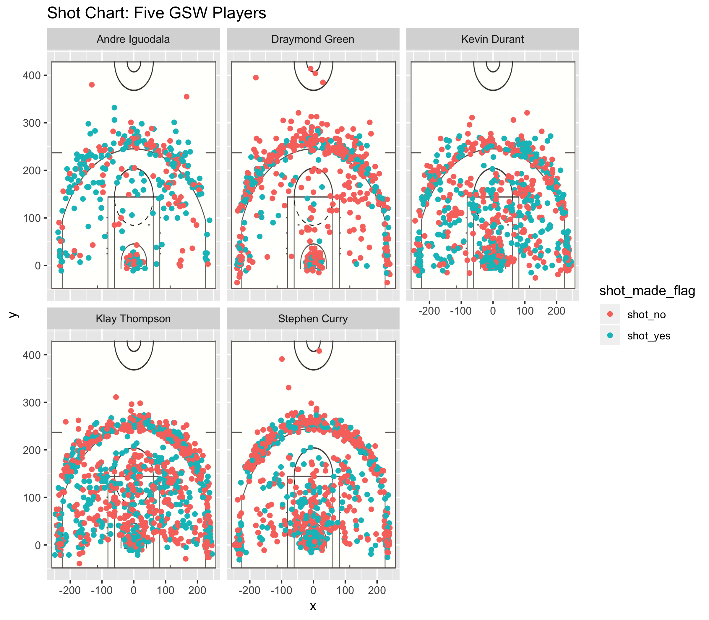

```{r}
library(dplyr)
library(ggplot2)
```

#GSW-Shot-Charts
```{r out.width= '80%', echo=FALSE ,fig.align='center'}


```

# Three Percentile Tables
```{r}
dat<-read.csv(file = '../data/shots-data.csv')
selected_dat = select(dat, player_name, shot_made_flag, shot_type)

effective_general <- arrange(summarise(group_by(selected_dat, player_name), total = n(), made = sum(shot_made_flag == 'shot_yes'), perc_made = made/total), desc(perc_made))
effective_general

effective_2PT <- arrange(summarise(group_by(selected_dat, player_name), total = sum(shot_type == '2PT Field Goal'), made = sum(shot_made_flag == 'shot_yes'& shot_type == '2PT Field Goal'), perc_made = made/total), desc(perc_made))
effective_2PT

effective_3PT <- arrange(summarise(group_by(selected_dat, player_name), total = sum(shot_type == '3PT Field Goal'), made = sum(shot_made_flag == 'shot_yes'& shot_type == '3PT Field Goal'), perc_made = made/total), desc(perc_made))
effective_3PT
```


```{r eval=FALSE}

#Introduction: Write a clear and captivating introduction that grabs the reader’s attention. And describe the purpose of the report.


#Organize the content: Organize the content of your report in different sections: e.g. motivation, background, data, analysis, discussion, conclusions, and references.


# Images: You may include some images like pictures about players, or other figures in addition to the requested facetted shot chart.


# Code: You may also include code snippets (e.g. code chunks) with output that supports your narrative.


# Take-home message: Make sure to include a summarizing statement of the content in your article. If the reader had to remember one major thing from your article, what would that be?


```


