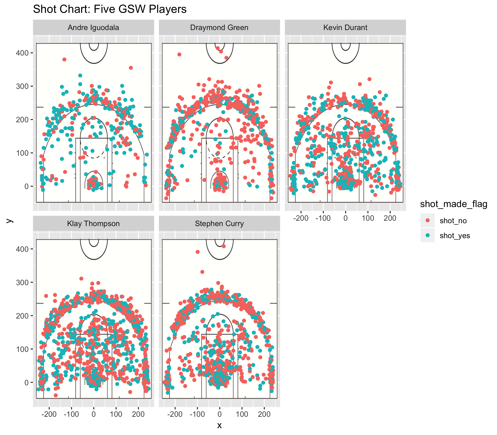

Stat133-Workout01-Report
================
Sophia Yan

``` r
library(dplyr)
```

    ## 
    ## Attaching package: 'dplyr'

    ## The following objects are masked from 'package:stats':
    ## 
    ##     filter, lag

    ## The following objects are masked from 'package:base':
    ## 
    ##     intersect, setdiff, setequal, union

``` r
library(ggplot2)
```

GSW-Shot-Charts
===============



Three Percentile Tables
=======================

``` r
dat<-read.csv(file = '../data/shots-data.csv')
selected_dat = select(dat, player_name, shot_made_flag, shot_type)

effective_general <- arrange(summarise(group_by(selected_dat, player_name), total = n(), made = sum(shot_made_flag == 'shot_yes'), perc_made = made/total), desc(perc_made))
effective_general
```

    ## # A tibble: 5 x 4
    ##   player_name    total  made perc_made
    ##   <fct>          <int> <int>     <dbl>
    ## 1 Kevin Durant     915   495     0.541
    ## 2 Andre Iguodala   371   192     0.518
    ## 3 Klay Thompson   1220   575     0.471
    ## 4 Stephen Curry   1250   584     0.467
    ## 5 Graymond Green   578   245     0.424

``` r
effective_2PT <- arrange(summarise(group_by(selected_dat, player_name), total = sum(shot_type == '2PT Field Goal'), made = sum(shot_made_flag == 'shot_yes'& shot_type == '2PT Field Goal'), perc_made = made/total), desc(perc_made))
effective_2PT
```

    ## # A tibble: 5 x 4
    ##   player_name    total  made perc_made
    ##   <fct>          <int> <int>     <dbl>
    ## 1 Andre Iguodala   210   134     0.638
    ## 2 Kevin Durant     643   390     0.607
    ## 3 Stephen Curry    563   304     0.540
    ## 4 Klay Thompson    640   329     0.514
    ## 5 Graymond Green   346   171     0.494

``` r
effective_3PT <- arrange(summarise(group_by(selected_dat, player_name), total = sum(shot_type == '3PT Field Goal'), made = sum(shot_made_flag == 'shot_yes'& shot_type == '3PT Field Goal'), perc_made = made/total), desc(perc_made))
effective_3PT
```

    ## # A tibble: 5 x 4
    ##   player_name    total  made perc_made
    ##   <fct>          <int> <int>     <dbl>
    ## 1 Klay Thompson    580   246     0.424
    ## 2 Stephen Curry    687   280     0.408
    ## 3 Kevin Durant     272   105     0.386
    ## 4 Andre Iguodala   161    58     0.360
    ## 5 Graymond Green   232    74     0.319

``` r
• Introduction: Write a clear and captivating introduction that grabs the reader’s attention. And describe the purpose of the report.
• Organize the content: Organize the content of your report in different sections: e.g. motivation, background, data, analysis, discussion, conclusions, and references.
• Images: You may include some images like pictures about players, or other figures in addition to the requested facetted shot chart.
• Code: You may also include code snippets (e.g. code chunks) with output that supports your narrative.
• Take-home message: Make sure to include a summarizing statement of the content in your article. If the reader had to remember one major thing from your article, what would that be?
• Length: How long should your article be? There is not really a unique answer for this question. It depends on what you decide to write about. Try writing a post no shorter than 1,000 words, and preferably no longer than 5,000 words (these values are just a recommendation).
```
